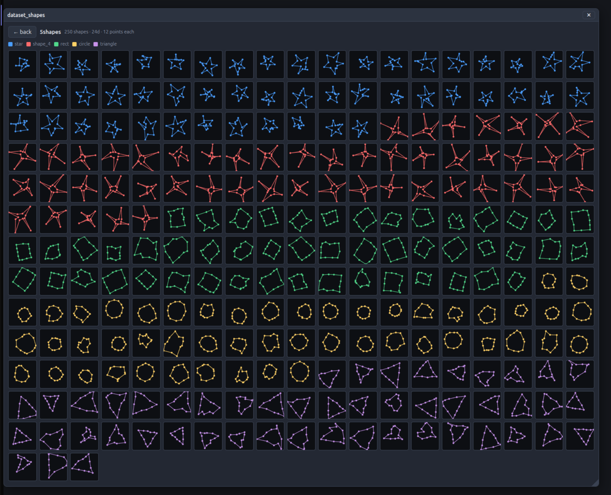

# Machine Learning

This is my repository for learning machine-learning techniques by implementing them
from scratch — no libraries, just the raw algorithm plus visualizations to see it work.

Implemented so far:

- [**k-means clustering**](#k-means-clustering-1d-from-scratch) — grouping 1D data into `k` clusters.
- [**k-means on shapes**](#k-means-on-shapes-2d-points--n-d-vectors) — turning 2D shapes into
  high-dimensional vectors and clustering them by shape (an interactive webapp).

---

# k-means clustering (1D, from scratch)

A tiny, dependency-free implementation of the **k-means** algorithm on a 1-dimensional
dataset, plus a self-drawn PNG plotter that records every step and stitches the frames
into an animated GIF. Lives in [`k_mean_cluster/`](k_mean_cluster/).

```bash
cd k_mean_cluster
deno run -A main.js
```

This runs the algorithm, writes one PNG per step into `k_mean_cluster/frames/`, and
renders a timestamped `k_means_<epoch>.gif`.

---

## Runs

Each GIF is one full run, captioned step by step:
`random datapoints` → `random means` → (`closest means` → `recalculate mean`)×N → `converged`.

Because the initial means are picked **randomly**, every run takes a different number of
iterations and can settle on a different grouping. That is the whole story of these six
runs — same data, different starting points, different outcomes.

| Timestamp | Iterations | Animation |
|---|---|---|
| 2026-07-03 15:37:04 | 2 |  |
| 2026-07-03 15:37:07 | 4 |  |
| 2026-07-03 15:37:07 | 5 |  |
| 2026-07-03 15:37:07 | 2 |  |
| 2026-07-03 15:37:08 | 2 |  |
| 2026-07-03 15:37:08 | 1 |  |

---

## What I learned building this

- **"Distance" generalizes to any number of dimensions.** The Euclidean distance
  (a.k.a. the **L2 norm**) is just Pythagoras with one squared term per component:
  `sqrt(Σ (aᵢ - bᵢ)²)`. A 5D point is not something to *picture* — the distance is simply
  "how different two measurement-lists are, as one number".

- **k-means is two steps in a loop.** *Assignment*: put each point in the group of its
  **nearest** mean. *Update*: move each mean to the **average** of its members. Repeat.
  The "search for the shortest distance" only happens in the assignment step.

- **A centroid is just the mean.** In 1D it's `sum / count`; in N-D you average each
  component separately. It usually isn't one of the real datapoints — it's a computed
  center. The name k-**means** comes from exactly this.

- **You don't need the `sqrt`.** k-means only compares distances to find the nearest
  mean, and `sqrt` is monotonic, so squared distance gives the same ordering — faster.

- **Convergence = the means stopped moving.** I track each mean's change per iteration
  (`n_mean__diff`) and stop when none of them moved. A `n_its_max` safety cap protects
  against floating-point runs that never *exactly* settle.

- **Edge cases bite.** An empty cluster gives `0 / 0 = NaN`; the first iteration has no
  previous mean, so the diff had to be seeded as "changed". Both had to be handled
  explicitly or the loop misbehaves.

- **Initialization matters a lot.** Picking existing datapoints (**Forgy init**) is safer
  than random points in the range, which can land in empty regions and create empty
  clusters. The six GIFs above show how different seeds converge in 1–5 iterations and
  can even reach different groupings — the motivation for smarter seeding like k-means++.

- **Visualizing an algorithm makes it click.** Recording a frame after each step and
  turning it into a GIF (via a hand-written PNG encoder + a 5×7 bitmap font for the
  captions + ffmpeg for the GIF) made every step of the loop obvious in a way the numbers
  alone never did.

---

## Files

All under [`k_mean_cluster/`](k_mean_cluster/):

| File | Purpose |
|---|---|
| `k_means_clustering.js` | the algorithm + per-step frame recording |
| `helper.js` | PNG encoder, drawing surface, bitmap font, frame recorder, GIF/video export |
| `generate_testdata.js` | random clustered 1D test data |
| `main.js` | entry point |

Requires [Deno](https://deno.com/) and `ffmpeg` on `PATH` (for the GIF step).

---

# k-means on shapes (2D points → N-D vectors)

An interactive webapp (Deno + WebSocket + SQLite server, Vue client) for building a
labeled dataset of **shapes** and clustering them with k-means. Lives in
[`k_mean_cluster/webapp/`](k_mean_cluster/webapp/).

```bash
cd k_mean_cluster/webapp/application
deno task start          # then open http://localhost:8000
```

The whole point of this experiment was to internalize one idea:

> **Any shape made of points can be turned into a single high-dimensional vector,
> and then k-means clusters those vectors just like it clusters plain numbers.**

A shape here is an ordered list of 2D points. If each shape has 10 points, I just lay
the coordinates out in a row — `[x₀, y₀, x₁, y₁, … x₉, y₉]` — and now every shape **is
one point in 20-dimensional space**. k-means never needs to know these came from a
drawing; it only ever measures Euclidean distance between 20-number lists. (A 3D shape
of 10 points would be a 30-D vector — the pipeline doesn't care.)

## The pipeline

**1. Define the shapes.** Each shape has a *fixed* number of points; you click to place
them and drag to move them. Below, five classes at 12 points each (so 24-D vectors):


**2. Generate an augmented dataset.** For each shape I stamp out many noisy copies, each
with a random rotation, scale, translation, and per-point jitter. This is the labeled
training data — here 250 shapes across 5 classes:



**3. Run k-means on the vectors.** Clustering happens in the full 24-D space. To *see*
250 points that live in 24 dimensions, I project them down to 2D with **PCA** — but only
for the picture; the clustering itself uses all 24 numbers. With `k = 5` the clusters
fall out cleanly and the centroids settle in 3 iterations:


**4. Check the result.** Recoloring the *original* shapes by the cluster k-means assigned
them to: each color is (almost entirely) one shape type — stars with stars, circles with
circles, triangles with triangles. k-means recovered the classes without ever being told
the labels:


## What I learned building this

- **Shapes → vectors is the whole trick.** The leap that finally clicked: a 2D (or 3D)
  shape of `n` points is just a `2n` (or `3n`) dimensional vector. Once you flatten it,
  *every* algorithm that works on vectors — k-means, PCA, nearest-neighbour — works on
  shapes for free. The geometry was never special; it was always just a list of numbers.

- **⚠️ It's crucial to normalize the data — without it nothing works.** This is the lesson
  that cost me the most. My first version clustered by *pose*, not by *shape*: a star rotated
  90° and a star shifted to the corner ended up as totally different 20-number lists, so
  k-means (which only sees distance between raw vectors) grouped "things in the top-left"
  together instead of "stars" together. The fix is to **normalize every vector to a
  canonical pose before clustering**:
  1. **translate** so the shape's center sits at the origin → *position no longer matters*
  2. **rotate** so a reference point lands on a fixed axis → *orientation no longer matters*
  3. **scale** to unit length → *size no longer matters*

  After that, the distance between two vectors reflects only their **shape difference**,
  which is the thing I actually wanted to cluster on. Same data, same k-means — purity
  jumped from ~33% (i.e. random) to ~100%. The mental model I'm still growing into:
  *k-means measures raw distance and nothing else, so I have to strip out every difference
  I don't care about (position, rotation, size) before it ever runs — otherwise those
  nuisance differences dominate and drown out the signal.*

- **PCA is for looking, not for deciding.** PCA squashes the 24-D data to 2D so I can *see*
  the clusters, but I deliberately do **not** cluster on the 2D projection — that would
  throw away 22 dimensions of information. Clustering runs on the full normalized vectors;
  PCA only draws the picture.

- **Augment on purpose, then normalize it away.** It feels contradictory: I *add* random
  rotation/scale/position to make the dataset varied and realistic, then the normalizer
  *removes* exactly those. That's the point — augmentation makes each sample noisy and
  distinct so the clusters have spread, while normalization guarantees that spread is
  about shape, not pose.

- **The random start is a lottery — "inertia" is how I score the tickets.** Because
  k-means seeds its centroids randomly, the *same* data can converge to different groupings
  on different runs, and some are plainly worse. **Inertia** (a.k.a. within-cluster sum of
  squares) puts a single number on "how good": the total squared distance from every point
  to *its* centroid. **Lower = tighter clusters = better.** It is exactly the quantity
  k-means is trying to minimize. So the trick to beat the lottery is simple: **run it many
  times and keep the lowest-inertia result.** In my app I can now see this literally — one
  run got stuck at inertia `7.17` while nine others found `0.05`, and I can click any run to
  watch the bad grouping it settled on.

- **Inertia can't choose `k` for you, though.** Careful: inertia *always* drops as `k`
  grows (more centroids → everything is closer; at `k = N` it hits 0). So it tells me which
  *run* is best for a fixed `k`, but not which `k` to use — for that you look at where the
  inertia curve *bends* (the "elbow"). Two different questions.

- **k-means++ = don't start the centroids on top of each other.** A smarter seeding: pick
  the first centroid at random, then pick each next one with probability proportional to its
  squared distance from the nearest chosen centroid — i.e. deliberately spread them out.
  This makes a good result likely in a *single* run instead of relying on many restarts. In
  my test a plain single run sometimes landed on inertia `7.17`; a single k-means++ run
  reliably found `0.05`.

## To do next

- **Learn and implement the PCA algorithm myself**, from scratch — understand the
  covariance matrix, eigenvectors, and power iteration well enough to write it unaided.
- **Learn and implement normalization myself**, from scratch — the translate / rotate /
  scale canonicalization that makes the clustering actually work.
- **Learn and implement inertia myself** — the within-cluster sum of squares, and the
  "run N times, keep the lowest" loop that uses it to beat a bad random start.
- **Learn and implement k-means++ myself** — the distance-weighted seeding that spreads the
  initial centroids out so a single run usually converges well.

## Files

Under [`k_mean_cluster/webapp/application/`](k_mean_cluster/webapp/application/):

| File | Purpose |
|---|---|
| `client/c_dataset_shapes.js` | shape editor: define/point/augment shapes, build + store a set |
| `client/c_k_means.js` | run k-means on a dataset or shape set, animate the steps |
| `server/k_means_nd.js` | **N-D k-means + per-vector normalization + PCA-to-2D projection** |
| `server/handlers.js` | WebSocket message handlers (create/store/cluster) |
| `server/db.js` | SQLite schema + queries for datasets, shape sets, samples |

Requires [Deno](https://deno.com/). The clustering, normalization, and PCA are all
hand-written — no ML libraries.
