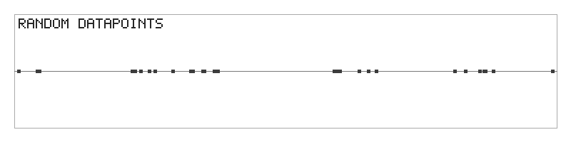
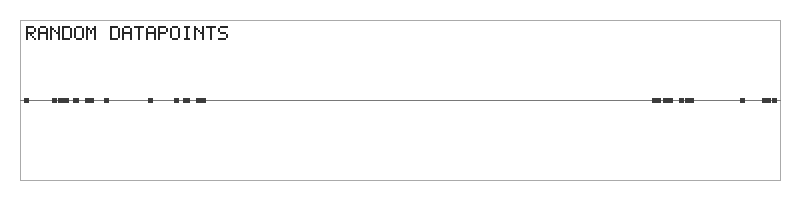
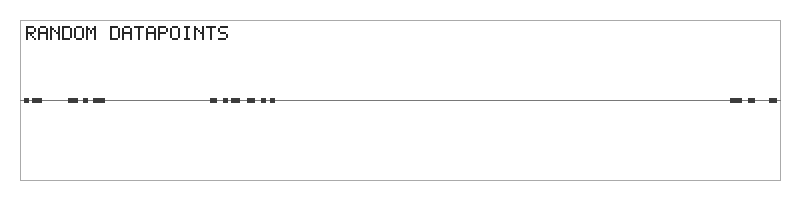
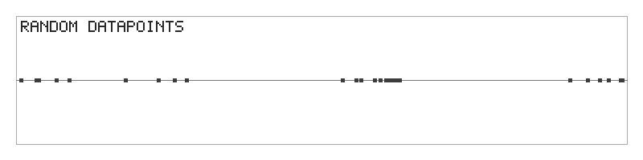
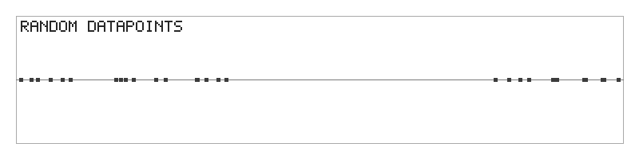

# Machine Learning

This is my repository for learning machine-learning techniques by implementing them
from scratch — no libraries, just the raw algorithm plus visualizations to see it work.

Implemented so far:

- [**k-means clustering**](#k-means-clustering-1d-from-scratch) — grouping 1D data into `k` clusters.

---

# k-means clustering (1D, from scratch)

A tiny, dependency-free implementation of the **k-means** algorithm on a 1-dimensional
dataset, plus a self-drawn PNG plotter that records every step and stitches the frames
into an animated GIF. Lives in [`k_mean_cluster/`](k_mean_cluster/).

```bash
cd k_mean_cluster
deno run -A main.js
```

This runs the algorithm, writes one PNG per step into `k_mean_cluster/frames/`, and
renders a timestamped `k_means_<epoch>.gif`.

---

## Runs

Each GIF is one full run, captioned step by step:
`random datapoints` → `random means` → (`closest means` → `recalculate mean`)×N → `converged`.

Because the initial means are picked **randomly**, every run takes a different number of
iterations and can settle on a different grouping. That is the whole story of these six
runs — same data, different starting points, different outcomes.

| Timestamp | Iterations | Animation |
|---|---|---|
| 2026-07-03 15:37:04 | 2 |  |
| 2026-07-03 15:37:07 | 4 |  |
| 2026-07-03 15:37:07 | 5 |  |
| 2026-07-03 15:37:07 | 2 |  |
| 2026-07-03 15:37:08 | 2 |  |
| 2026-07-03 15:37:08 | 1 |  |

---

## What I learned building this

- **"Distance" generalizes to any number of dimensions.** The Euclidean distance
  (a.k.a. the **L2 norm**) is just Pythagoras with one squared term per component:
  `sqrt(Σ (aᵢ - bᵢ)²)`. A 5D point is not something to *picture* — the distance is simply
  "how different two measurement-lists are, as one number".

- **k-means is two steps in a loop.** *Assignment*: put each point in the group of its
  **nearest** mean. *Update*: move each mean to the **average** of its members. Repeat.
  The "search for the shortest distance" only happens in the assignment step.

- **A centroid is just the mean.** In 1D it's `sum / count`; in N-D you average each
  component separately. It usually isn't one of the real datapoints — it's a computed
  center. The name k-**means** comes from exactly this.

- **You don't need the `sqrt`.** k-means only compares distances to find the nearest
  mean, and `sqrt` is monotonic, so squared distance gives the same ordering — faster.

- **Convergence = the means stopped moving.** I track each mean's change per iteration
  (`n_mean__diff`) and stop when none of them moved. A `n_its_max` safety cap protects
  against floating-point runs that never *exactly* settle.

- **Edge cases bite.** An empty cluster gives `0 / 0 = NaN`; the first iteration has no
  previous mean, so the diff had to be seeded as "changed". Both had to be handled
  explicitly or the loop misbehaves.

- **Initialization matters a lot.** Picking existing datapoints (**Forgy init**) is safer
  than random points in the range, which can land in empty regions and create empty
  clusters. The six GIFs above show how different seeds converge in 1–5 iterations and
  can even reach different groupings — the motivation for smarter seeding like k-means++.

- **Visualizing an algorithm makes it click.** Recording a frame after each step and
  turning it into a GIF (via a hand-written PNG encoder + a 5×7 bitmap font for the
  captions + ffmpeg for the GIF) made every step of the loop obvious in a way the numbers
  alone never did.

---

## Files

All under [`k_mean_cluster/`](k_mean_cluster/):

| File | Purpose |
|---|---|
| `k_means_clustering.js` | the algorithm + per-step frame recording |
| `helper.js` | PNG encoder, drawing surface, bitmap font, frame recorder, GIF/video export |
| `generate_testdata.js` | random clustered 1D test data |
| `main.js` | entry point |

Requires [Deno](https://deno.com/) and `ffmpeg` on `PATH` (for the GIF step).
